# Python Script Flow Diagram Analysis

## Program Flow Summary

### Overview
This script is a test Python program themed around LSU Tigers football fandom. It runs a sequence of five functions within a `try/except` block in the `__main__` entry point.

### Function Descriptions

#### `get_input()`
Prompts the user for their name. If the name (case-insensitive, trimmed) equals "ryan", it prints "GEAUX TIGERS"; otherwise, it prints "You are not Ryan". Returns the name.

#### `get_score()`
Asks the user for Alabama's and LSU's scores. Compares them and prints a message favoring LSU if they scored more, or expressing displeasure otherwise. **Note:** This function has a bug — it compares strings lexicographically, not numerically, since `input()` returns strings and no `int()` conversion is performed.

#### `predict_wl()`
Loops indefinitely, asking the user to guess how many games LSU will win out of 12. Only accepts the answer `12`. Handles non-integer input via `ValueError` exception. The loop breaks only when the user enters `12`.

#### `national_champs()`
Prints that LSU will be national champs. The `if True` block always executes — there is no real decision here, but it is represented structurally.

#### `print_hello()`
Simply prints two greeting lines: "Hello Sam" and "Hello Ryan".

### Notes
- The main block wraps all calls in a `try/except Exception` to catch and print any unexpected errors.
- `get_score()` returns `None` implicitly (its return value is assigned to `input_2` but never used).
- `predict_wl()` is the only function with a loop construct.

---

## Flow Diagram

```mermaid
flowchart TB
    classDef startStyle fill:#90EE90,stroke:#333,color:#000
    classDef endStyle fill:#FFB6C6,stroke:#333,color:#000
    classDef decisionStyle fill:#FFE4B5,stroke:#333,color:#000
    classDef exceptionStyle fill:#FFA07A,stroke:#333,color:#000

    Start(["▶ Start: __main__"]):::startStyle
    TryBegin["Enter try block"]
    CallGetInput["Call get_input()"]
    CallGetScore["Call get_score()"]
    CallPredictWL["Call predict_wl()"]
    CallNationalChamps["Call national_champs()"]
    CallPrintHello["Call print_hello()"]
    MainEnd(["⏹ End Program"]):::endStyle

    ExceptBlock["except Exception as e"]:::exceptionStyle
    PrintException["print(e)"]:::exceptionStyle

    Start --> TryBegin
    TryBegin --> CallGetInput
    CallGetInput --> GI_Entry

    subgraph get_input_sg ["get_input()"]
        direction LR
        GI_Entry(["Enter"]):::startStyle
        GI_Prompt["name_input = input('Enter your name: ')"]
        GI_Decision{"name_input.lower().strip()\n== 'ryan'?"}:::decisionStyle
        GI_Yes["print('GEAUX TIGERS')"]
        GI_No["print('You are not Ryan')"]
        GI_Return["return name_input"]
        GI_Exit(["Exit"]):::endStyle

        GI_Entry --> GI_Prompt
        GI_Prompt --> GI_Decision
        GI_Decision -->|Yes| GI_Yes
        GI_Decision -->|No| GI_No
        GI_Yes --> GI_Return
        GI_No --> GI_Return
        GI_Return --> GI_Exit
    end

    GI_Exit --> CallGetScore
    CallGetScore --> GS_Entry

    subgraph get_score_sg ["get_score()"]
        direction LR
        GS_Entry(["Enter"]):::startStyle
        GS_BamaInput["bama_score = input('how many points did bama score?: ')"]
        GS_LSUInput["lsu_score = input('how many points did lsu score?: ')"]
        GS_Decision{"lsu_score > bama_score?\n(string comparison)"}:::decisionStyle
        GS_Yes["print('Get on the Lane Train!')"]
        GS_No["print('Somebody fire this bum')"]
        GS_Exit(["Exit"]):::endStyle

        GS_Entry --> GS_BamaInput
        GS_BamaInput --> GS_LSUInput
        GS_LSUInput --> GS_Decision
        GS_Decision -->|Yes| GS_Yes
        GS_Decision -->|No| GS_No
        GS_Yes --> GS_Exit
        GS_No --> GS_Exit
    end

    GS_Exit --> CallPredictWL
    CallPredictWL --> PW_Entry

    subgraph predict_wl_sg ["predict_wl()"]
        direction LR
        PW_Entry(["Enter"]):::startStyle
        PW_LoopStart{"while True"}:::decisionStyle
        PW_TryBlock["Enter try block"]
        PW_Input["wins_guess = int(input('...How many games will they win?: '))"]
        PW_Check{"wins_guess == 12?"}:::decisionStyle
        PW_Correct["print('You are purty smart!')"]
        PW_Break["break"]
        PW_Wrong["print('Incorrect. Try again')"]
        PW_ValueError["except ValueError:\nprint('That''s not a valid integer...')"]:::exceptionStyle
        PW_Exit(["Exit"]):::endStyle

        PW_Entry --> PW_LoopStart
        PW_LoopStart -->|Iterate| PW_TryBlock
        PW_TryBlock --> PW_Input
        PW_Input --> PW_Check
        PW_Check -->|Yes| PW_Correct
        PW_Correct --> PW_Break
        PW_Break --> PW_Exit
        PW_Check -->|No| PW_Wrong
        PW_Wrong --> PW_LoopStart
        PW_Input -. "ValueError" .-> PW_ValueError
        PW_ValueError --> PW_LoopStart
    end

    PW_Exit --> CallNationalChamps
    CallNationalChamps --> NC_Entry

    subgraph national_champs_sg ["national_champs()"]
        direction LR
        NC_Entry(["Enter"]):::startStyle
        NC_Print1["print('Who will be the national champs?')"]
        NC_Decision{"if True"}:::decisionStyle
        NC_Body["print('LSU!!!')\nprint('Bama stinks')"]
        NC_Exit(["Exit"]):::endStyle

        NC_Entry --> NC_Print1
        NC_Print1 --> NC_Decision
        NC_Decision -->|"Always True"| NC_Body
        NC_Body --> NC_Exit
    end

    NC_Exit --> CallPrintHello
    CallPrintHello --> PH_Entry

    subgraph print_hello_sg ["print_hello()"]
        direction LR
        PH_Entry(["Enter"]):::startStyle
        PH_Sam["print('Hello Sam')"]
        PH_Ryan["print('Hello Ryan')"]
        PH_Exit(["Exit"]):::endStyle

        PH_Entry --> PH_Sam
        PH_Sam --> PH_Ryan
        PH_Ryan --> PH_Exit
    end

    PH_Exit --> MainEnd

    TryBegin -. "Exception raised" .-> ExceptBlock
    ExceptBlock --> PrintException
    PrintException --> MainEnd
```

