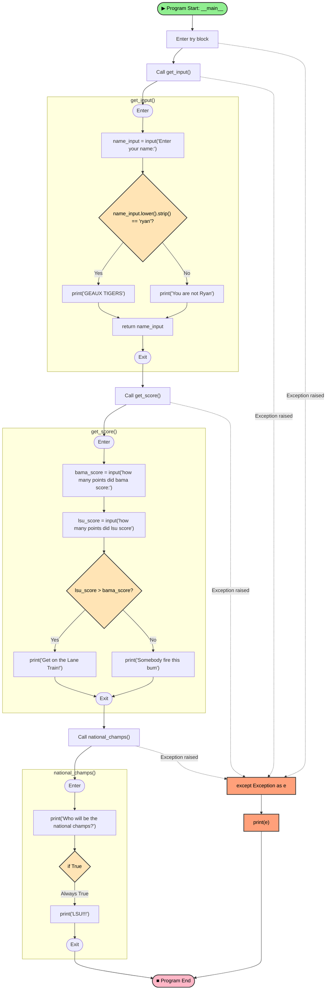

# Python Script Flow Analysis

<table>
<tr>
<td width="25%" valign="top">

## Program Flow Summary

This script is a fun LSU Tigers-themed Python program that:

1. **Starts** in the `__main__` block wrapped in a try/except
2. **Calls `get_input()`** — prompts for a name and checks if it's "ryan"
3. **Calls `get_score()`** — compares LSU vs Bama scores
4. **Calls `national_champs()`** — always prints "LSU!!!"

---

## Function Descriptions

### `get_input()`
- Prompts user for their name
- If name is "ryan" (case-insensitive, stripped), prints "GEAUX TIGERS"
- Otherwise prints "You are not Ryan"
- Returns the name

### `get_score()`
- Prompts for Bama's score and LSU's score
- Compares the two scores (note: string comparison, not integer)
- Prints a message based on which is greater

### `national_champs()`
- Prints a question about national champs
- Contains an `if True` block that always executes
- Always prints "LSU!!!"

---

## Notes

- ⚠️ **Bug**: `get_score()` compares strings, not integers. Scores should be cast with `int()`.
- The `if True` in `national_champs()` is always truthy — the else branch is unreachable.
- Exception handling catches all exceptions and prints the error message.
- Color legend:
  - 🟢 Start nodes
  - 🔴 End nodes
  - 🟡 Decision nodes
  - 🟠 Exception handling

</td>
<td width="75%" valign="top">

</td>
</tr>
</table>