# Python Script Flow Analysis

<table>
<tr>
<td style="vertical-align: top; width: 25%;">

## Program Flow Summary

This script is an LSU Tigers themed interactive Python program that collects user input and displays themed messages.

## Function Descriptions

### 1. `get_input()`
Prompts the user for their name. If the name is "ryan" (case-insensitive, stripped), prints "GEAUX TIGERS"; otherwise prints "You are not Ryan."

### 2. `get_score()`
Asks for Alabama and LSU scores. Compares them and prints a message based on who scored higher. **Note:** contains a bug — compares strings, not integers.

### 3. `national_champs()`
Always prints "LSU!!!" and "Bama stinks" because the condition is hardcoded to `True`.

### 4. `predict_wl()`
Loops until the user guesses 12 wins. Handles `ValueError` for non-integer input.

### 5. `print_hello()`
Simply prints "Hello Sam".

## Notes

- The `__main__` block wraps all calls in a `try/except` for generic exception handling.
- `get_score()` has a subtle bug: it compares string values rather than integers, leading to lexicographic comparison.
- `national_champs()` has a dead branch — the `if True` condition means the else path is unreachable.
- `predict_wl()` is the only function with a loop and nested exception handling.

```mermaid
flowchart TB
    classDef startNode fill:#90EE90,stroke:#333,stroke-width:2px,color:#000
    classDef endNode fill:#FFB6C6,stroke:#333,stroke-width:2px,color:#000
    classDef decisionNode fill:#FFE4B5,stroke:#333,stroke-width:2px,color:#000
    classDef exceptionNode fill:#FFA07A,stroke:#333,stroke-width:2px,color:#000

    Start(["▶ Start: __main__"]):::startNode
    MainTryStart["Enter try block"]
    CallGetInput["Call get_input()"]
    CallGetScore["Call get_score()"]
    CallPredictWL["Call predict_wl()"]
    CallNationalChamps["Call national_champs()"]
    CallPrintHello["Call print_hello()"]
    MainExcept["except Exception as e"]:::exceptionNode
    PrintMainError["print(e)"]:::exceptionNode
    EndProgram(["■ End Program"]):::endNode

    Start --> MainTryStart
    MainTryStart --> CallGetInput
    CallGetInput --> GI_Entry

    subgraph get_input_sub ["get_input()"]
        direction LR
        GI_Entry(["Enter"]):::startNode --> GI_NameInput[/"input: Enter your name"/]
        GI_NameInput --> GI_Check{"name == 'ryan'?"}:::decisionNode
        GI_Check -->|Yes| GI_Geaux["print: GEAUX TIGERS"]
        GI_Check -->|No| GI_NotRyan["print: You are not Ryan"]
        GI_Geaux --> GI_Return["return name_input"]
        GI_NotRyan --> GI_Return
        GI_Return --> GI_Exit(["Exit"]):::endNode
    end

    GI_Exit --> CallGetScore
    CallGetScore --> GS_Entry

    subgraph get_score_sub ["get_score()"]
        direction LR
        GS_Entry(["Enter"]):::startNode --> GS_BamaInput[/"input: bama score"/]
        GS_BamaInput --> GS_LSUInput[/"input: lsu score"/]
        GS_LSUInput --> GS_Compare{"lsu_score > bama_score?"}:::decisionNode
        GS_Compare -->|Yes| GS_LaneTrain["print: Get on the Lane Train!"]
        GS_Compare -->|No| GS_FireBum["print: Somebody fire this bum"]
        GS_LaneTrain --> GS_Exit(["Exit"]):::endNode
        GS_FireBum --> GS_Exit
    end

    GS_Exit --> CallPredictWL
    CallPredictWL --> PW_Entry

    subgraph predict_wl_sub ["predict_wl()"]
        direction LR
        PW_Entry(["Enter"]):::startNode --> PW_LoopStart{"while True"}:::decisionNode
        PW_LoopStart --> PW_TryStart["Enter try block"]
        PW_TryStart --> PW_Input[/"input: How many wins?"/]
        PW_Input --> PW_IntParse["int() conversion"]
        PW_IntParse --> PW_CheckVal{"wins_guess == 12?"}:::decisionNode
        PW_CheckVal -->|Yes| PW_Smart["print: You are purty smart!"]
        PW_Smart --> PW_Break["break"]
        PW_Break --> PW_Exit(["Exit"]):::endNode
        PW_CheckVal -->|No| PW_Incorrect["print: Incorrect. Try again"]
        PW_Incorrect --> PW_LoopStart
        PW_IntParse -. "ValueError" .-> PW_ValErr["print: not a valid integer"]:::exceptionNode
        PW_ValErr --> PW_LoopStart
    end

    PW_Exit --> CallNationalChamps
    CallNationalChamps --> NC_Entry

    subgraph national_champs_sub ["national_champs()"]
        direction LR
        NC_Entry(["Enter"]):::startNode --> NC_AskWho["print: Who will be the national champs?"]
        NC_AskWho --> NC_IfTrue{"if True"}:::decisionNode
        NC_IfTrue -->|"Always True"| NC_LSU["print: LSU!!!"]
        NC_LSU --> NC_BamaStinks["print: Bama stinks"]
        NC_BamaStinks --> NC_Exit(["Exit"]):::endNode
    end

    NC_Exit --> CallPrintHello
    CallPrintHello --> PH_Entry

    subgraph print_hello_sub ["print_hello()"]
        direction LR
        PH_Entry(["Enter"]):::startNode --> PH_Print["print: Hello Sam"]
        PH_Print --> PH_Exit(["Exit"]):::endNode
    end

    PH_Exit --> EndProgram

    MainTryStart -. "Exception" .-> MainExcept
    CallGetInput -. "Exception" .-> MainExcept
    CallGetScore -. "Exception" .-> MainExcept
    CallPredictWL -. "Exception" .-> MainExcept
    CallNationalChamps -. "Exception" .-> MainExcept
    CallPrintHello -. "Exception" .-> MainExcept
    MainExcept --> PrintMainError
    PrintMainError --> EndProgram
```

</td>
<td style="width: 75%;">

</td>
</tr>
</table>